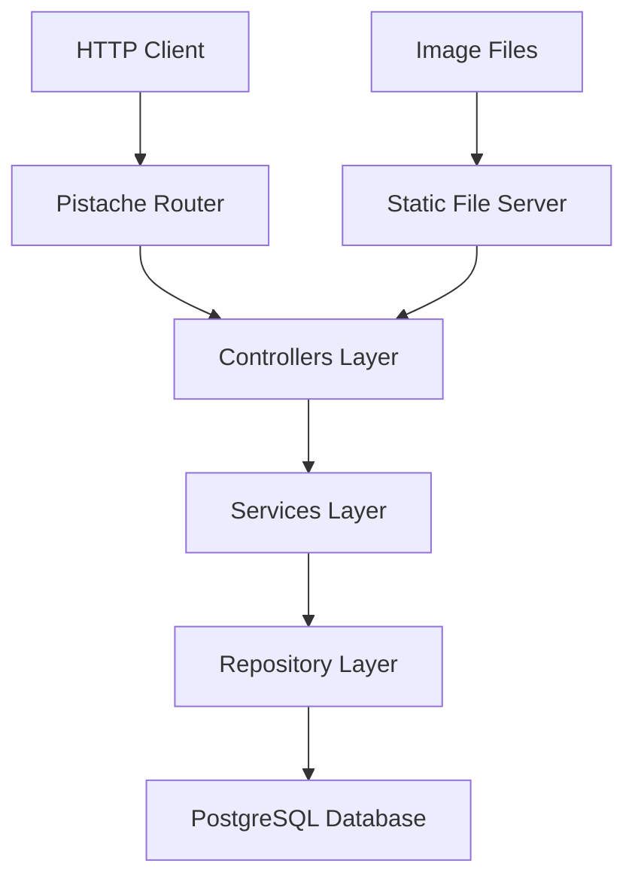
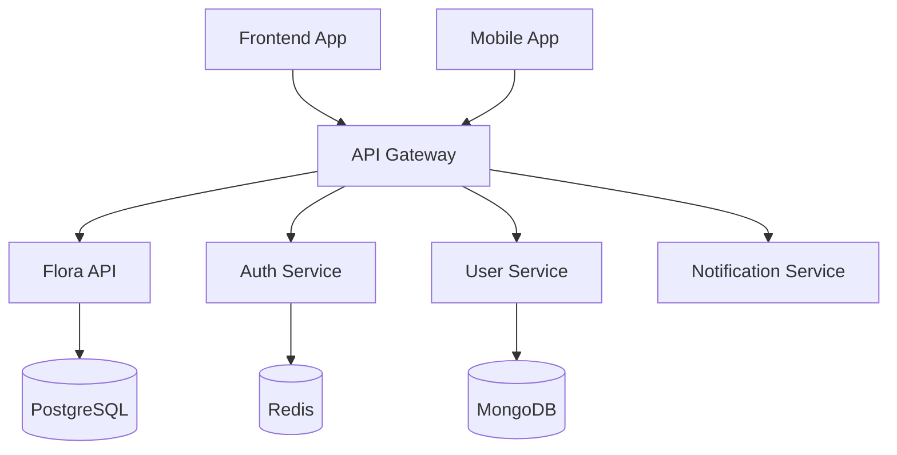

# Chiloé Especies API

**Microservicio REST para la gestión de especies multi-reino (Animalia, Plantae, Fungi, Protista, Monera) de Chiloé**

> Renombrado desde `flora-api` en la Fase 1 del plan maestro. Ver [docs/PLAN_MAESTRO.md](../../docs/PLAN_MAESTRO.md) en el repo raíz.

[](https://en.cppreference.com/w/cpp/17)
[](https://www.postgresql.org/)
[](https://www.docker.com/)
[](https://opensource.org/licenses/MIT)

## 📋 Descripción

Chiloé Especies API es un microservicio especializado en la gestión de información taxonómica de la biodiversidad del Archipiélago de Chiloé en los cinco reinos (Animalia, Plantae, Fungi, Protista, Monera). Forma parte de una arquitectura de microservicios más amplia y proporciona endpoints RESTful para la gestión completa de familias, géneros y especies, incluyendo la gestión de imágenes asociadas.

### 🎯 Características Principales

- **🔍 Gestión Taxonómica Completa**: CRUD para Familias, Géneros y Especies
- **🖼️ Gestión Multimedia**: Subida, visualización y gestión de imágenes
- **🔍 Búsquedas Especializadas**: Por nombre científico, género, familia
- **🏗️ Arquitectura Limpia**: Patrón Repository, separación por capas
- **🚀 Alto Rendimiento**: Framework Pistache con C++17
- **📊 Base de Datos Robusta**: PostgreSQL con transacciones ACID
- **🐳 Containerización**: Docker para desarrollo y despliegue
- **🔧 Hot Reload**: Desarrollo ágil con recarga automática

## 🏛️ Arquitectura



### 🗂️ Estructura Jerárquica de Datos

```
Familia
├── Género 1
│   ├── Especie 1
│   └── Especie 2
└── Género 2
    └── Especie 3
```

## 🚀 Inicio Rápido

### 📋 Prerrequisitos

- **Docker** 20.10+
- **Docker Compose** 2.0+
- **Git** 2.30+

### 🏃‍♂️ Desarrollo Local

1. **Clonar el repositorio**
```bash
git clone <repository-url>
cd especies-api
```

2. **Configurar variables de entorno**
```bash
cp .env.example .env
# Editar .env con tus configuraciones
```

3. **Iniciar entorno de desarrollo**
```bash
chmod +x dev.sh
./dev.sh
```

4. **Verificar funcionamiento**
```bash
curl http://localhost:9081/health
# Respuesta esperada: "OK"
```

### 🐳 Docker Compose - Desarrollo

```yaml
# docker-compose.dev.yml
services:
  especies-api:
    build:
      dockerfile: Dockerfile.dev.dock
    ports:
      - "9081:9080"
    volumes:
      - ./src:/app/src
      - ./include:/app/include
    environment:
      - HOT_RELOAD=true
```

**Comandos útiles:**
```bash
# Iniciar servicios
docker-compose -f docker-compose.dev.yml up --build

# Ver logs en tiempo real
docker-compose -f docker-compose.dev.yml logs -f especies-api

# Reiniciar solo la API
docker-compose -f docker-compose.dev.yml restart especies-api

# Limpiar contenedores y volúmenes
./dev.sh clean
```

## 🔧 Compilación Manual

### 📦 Dependencias del Sistema

**Ubuntu/Debian:**
```bash
sudo apt-get update && sudo apt-get install -y \
    build-essential \
    cmake \
    libpq-dev \
    libssl-dev \
    libpistache-dev \
    nlohmann-json3-dev \
    libpqxx-dev
```

**Arch Linux:**
```bash
sudo pacman -S base-devel cmake postgresql-libs openssl pistache nlohmann-json libpqxx
```

### 🏗️ Compilación

```bash
mkdir build && cd build
cmake -DCMAKE_BUILD_TYPE=Release ..
make -j$(nproc)
./chiloe_especies_api
```

## 📡 API Endpoints

### 🌱 Familias

| Método | Endpoint | Descripción |
|--------|----------|-------------|
| `GET` | `/api/familias` | Listar todas las familias |
| `GET` | `/api/familias/{id}` | Obtener familia por ID |
| `POST` | `/api/familias` | Crear nueva familia |
| `PUT` | `/api/familias/{id}` | Actualizar familia |
| `DELETE` | `/api/familias/{id}` | Eliminar familia |
| `GET` | `/api/familias/search/nombre?nombre=Rosaceae` | Buscar por nombre |

### 🌿 Géneros

| Método | Endpoint | Descripción |
|--------|----------|-------------|
| `GET` | `/api/generos` | Listar todos los géneros |
| `GET` | `/api/generos/{id}` | Obtener género por ID |
| `POST` | `/api/generos` | Crear nuevo género |
| `PUT` | `/api/generos/{id}` | Actualizar género |
| `DELETE` | `/api/generos/{id}` | Eliminar género |

### 🍃 Especies

| Método | Endpoint | Descripción |
|--------|----------|-------------|
| `GET` | `/api/especies` | Listar todas las especies |
| `GET` | `/api/especies/{id}` | Obtener especie por ID |
| `POST` | `/api/especies` | Crear nueva especie |
| `PUT` | `/api/especies/{id}` | Actualizar especie |
| `DELETE` | `/api/especies/{id}` | Eliminar especie |
| `GET` | `/api/especies/search/nombre?nombre=Drimys` | Buscar por nombre científico |
| `GET` | `/api/especies/search/genero/{nombre}` | Buscar por género |

### 🖼️ Imágenes

| Método | Endpoint | Descripción |
|--------|----------|-------------|
| `POST` | `/api/{entidad}/{id}/images/{principal}` | Subir imagen |
| `GET` | `/api/{entidad}/{id}/images` | Listar imágenes |
| `PUT` | `/api/{entidad}/{id}/images/{url}` | Establecer imagen principal |
| `GET` | `/api/images/{entidad}/{filename}` | Servir imagen |
| `DELETE` | `/api/images/{entidad}/{filename}` | Eliminar imagen |

## 📊 Ejemplos de Uso

### Crear una nueva familia
```bash
curl -X POST http://localhost:9081/api/familias \
  -H "Content-Type: application/json" \
  -d '{
    "nombre": "Rosaceae",
    "descripcion": "Familia de plantas con flores en forma de rosa",
    "nombre_comun": "Familia de las rosas"
  }'
```

### Buscar especies por nombre científico
```bash
curl "http://localhost:9081/api/especies/search/nombre?nombre=Drimys%20winteri"
```

### Subir imagen para una especie
```bash
curl -X POST http://localhost:9081/api/especies/1/images/true \
  -H "Content-Type: application/octet-stream" \
  --data-binary @imagen_especie.jpg
```

### Respuesta típica
```json
{
  "success": true,
  "data": {
    "id": 1,
    "nombre": "Drimys winteri",
    "nombre_comun": "Canelo",
    "descripcion": "Árbol sagrado del pueblo mapuche",
    "familia": "Winteraceae",
    "genero": "Drimys",
    "imagen_principal": "/api/images/especies/especie_1_123456789.jpg"
  },
  "message": "Especie obtenida exitosamente"
}
```

## ⚙️ Configuración

### 🔧 Variables de Entorno

```bash
# API Configuration
API_PORT=9080                    # Puerto del servidor
API_HOST=0.0.0.0                # Host de escucha

# Database Configuration
DB_HOST=localhost               # Host de PostgreSQL
DB_PORT=5432                   # Puerto de PostgreSQL
DB_NAME=chiloe_flora_db        # Nombre de la base de datos
DB_USER=postgres               # Usuario de la base de datos
DB_PASSWORD=postgres           # Contraseña de la base de datos

# Development
RELOAD_ON_CHANGE=true          # Hot reload en desarrollo
CMAKE_BUILD_TYPE=Debug         # Tipo de compilación
```

### 🗄️ Configuración de Base de Datos

La aplicación crea automáticamente las tablas necesarias:

```sql
-- Tablas principales
CREATE TABLE familias (
    id SERIAL PRIMARY KEY,
    nombre VARCHAR(255) UNIQUE NOT NULL,
    nombre_comun VARCHAR(255),
    descripcion TEXT,
    imagen_principal VARCHAR(500)
);

CREATE TABLE generos (
    id SERIAL PRIMARY KEY,
    nombre VARCHAR(255) UNIQUE NOT NULL,
    nombre_comun VARCHAR(255),
    descripcion TEXT,
    familia_id INTEGER REFERENCES familias(id),
    imagen_principal VARCHAR(500)
);

CREATE TABLE especies (
    id SERIAL PRIMARY KEY,
    nombre_cientifico VARCHAR(255) UNIQUE NOT NULL,
    nombre_comun VARCHAR(255),
    descripcion TEXT,
    genero_id INTEGER REFERENCES generos(id),
    imagen_principal VARCHAR(500)
);
```

## 🚀 Despliegue

### 🐳 Docker Production

```bash
# Construir imagen de producción
docker build -t especies-api:latest .

# Ejecutar con Docker Compose
docker-compose up -d
```

### ☸️ Kubernetes (Próximamente)

```yaml
# kubernetes/deployment.yaml
apiVersion: apps/v1
kind: Deployment
metadata:
  name: especies-api
spec:
  replicas: 3
  selector:
    matchLabels:
      app: especies-api
  template:
    metadata:
      labels:
        app: especies-api
    spec:
      containers:
      - name: especies-api
        image: especies-api:latest
        ports:
        - containerPort: 9080
        env:
        - name: DB_HOST
          value: "postgres-service"
```

### 🎯 Minikube Local

```bash
# Iniciar Minikube
minikube start

# Aplicar manifiestos
kubectl apply -f kubernetes/

# Exponer servicio
minikube service especies-api --url
```

## 🧪 Testing

### 🔍 Health Check

```bash
curl http://localhost:9081/health
```

### 🧹 Análisis Estático

```bash
# En el directorio build
make static-analysis    # Análisis completo
make quick-analysis    # Solo errores críticos
make format           # Formatear código
```

### 📊 Métricas de Rendimiento

```bash
# Compilación optimizada
cmake -DCMAKE_BUILD_TYPE=Release ..
make -j$(nproc)

# Análisis con Valgrind (memoria)
valgrind --leak-check=full ./chiloe_especies_api

# Profiling con gprof
gprof chiloe_especies_api gmon.out > analysis.txt
```

## 🏗️ Arquitectura de Microservicios

### 🌐 Ecosistema Completo



### 🔗 Integración con otros servicios

- **API Gateway**: Nginx, Kong, o Istio
- **Service Discovery**: Consul o Kubernetes DNS
- **Logging**: ELK Stack (Elasticsearch, Logstash, Kibana)
- **Monitoring**: Prometheus + Grafana
- **Messaging**: RabbitMQ o Apache Kafka

## 🤝 Contribución

### 📝 Guía para Contribuidores

1. **Fork** del repositorio
2. **Crear** rama feature (`git checkout -b feature/nueva-funcionalidad`)
3. **Commit** cambios (`git commit -am 'Agregar nueva funcionalidad'`)
4. **Push** a la rama (`git push origin feature/nueva-funcionalidad`)
5. **Crear** Pull Request

### 📐 Estándares de Código

- **Estilo**: Google C++ Style Guide
- **Documentación**: Doxygen comments
- **Testing**: Unit tests con Google Test
- **Commits**: Conventional Commits

```cpp
/**
 * @brief Obtiene una especie por su ID
 * @param id Identificador único de la especie
 * @return std::optional<Especie> La especie si existe, std::nullopt si no
 * @throws std::invalid_argument Si el ID no es válido
 */
std::optional<Especie> getEspecieById(int id) const;
```

## 📚 Documentación Adicional

- [🏗️ Estructura del Proyecto](STRUCTURE.md)
- [🔧 Guía de Desarrollo](docs/DEVELOPMENT.md)
- [🚀 Guía de Despliegue](docs/DEPLOYMENT.md)
- [📡 Documentación de API](docs/API.md)
- [🐳 Docker Guide](docs/DOCKER.md)

## 📄 Licencia

Este proyecto está licenciado bajo la Licencia MIT - ver el archivo [LICENSE](LICENSE) para más detalles.

## 👥 Equipo

- **Desarrollador Principal**: [Tu Nombre]
- **Arquitecto**: [Nombre del Arquitecto]
- **DevOps**: [Nombre DevOps]

## 📞 Soporte

- **Issues**: [GitHub Issues](../../issues)
- **Discusiones**: [GitHub Discussions](../../discussions)
- **Email**: support@chiloe-flora.com
- **Slack**: #especies-api-support

---

<p align="center">
  <strong>🌿 Preservando la biodiversidad de Chiloé a través de la tecnología 🌿</strong>
</p>

<p align="center">
  Hecho en Chile
</p>